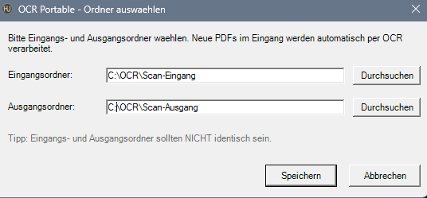
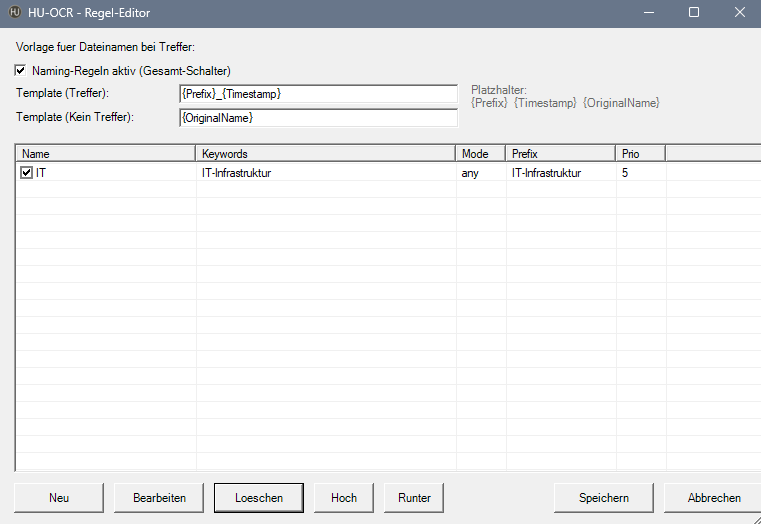

# HU-OCR

Portable OCR-Lösung für Windows. Überwacht einen Eingangsordner, erkennt neue PDFs automatisch, führt deutsche Texterkennung durch und legt durchsuchbare PDF/A-Dateien im Ausgangsordner ab. Optionale Keyword-Regeln benennen die Ausgabe automatisch um.

## Features

- **100 % portable** – ein Ordner, kein System-Install, keine Admin-Rechte nötig
- **Auto-Bootstrap** – lädt beim ersten Start Python, Tesseract, Ghostscript, qpdf automatisch nach `bin\`
- **FileSystemWatcher** – neue PDFs werden sofort erkannt
- **Netzwerk-robust** – UNC-Reconnect, Error-Recovery, 64 KB FSW-Buffer
- **Deutsche OCR** – Tesseract 5 mit `deu.traineddata`, Deskew + Auto-Rotate
- **PDF/A-Ausgabe** – archivierungssicher
- **Keyword-basierte Benennung** – Regeln mit Präfixen, Priorität, any/all Matching, GUI-Editor
- **Self-Update** – beim Start automatische Versionsprüfung gegen GitHub
- **Multi-PC-Deploy** – `Pull-OCR.cmd` zieht die aktuelle Version aus dem Repo

## Schnellstart

1. Ordner kopieren.
2. `Start-OCR.cmd` doppelklicken.
3. Beim First-Run lädt das Tool alle Abhängigkeiten (ca. 400 MB).
4. Ordner auswählen (Standard-Vorschlag: `Scan-Eingang` + `Scan-Ausgang` im Tool-Ordner).
5. Optional: `Rules-OCR.cmd` → Keyword-Regeln für automatische Umbenennung definieren.
6. PDFs in den Eingangsordner legen → fertig.

Siehe **[Anleitung.md](./Anleitung.md)** für Details.

## Screenshots

### Ordner-Auswahl


### Regel-Editor


## Repo-Struktur

```
HU-OCR\
├── Start-OCR.cmd           (Watcher starten / First-Run)
├── Config-OCR.cmd          (Ordner neu wählen)
├── Rules-OCR.cmd           (Naming-Regeln editieren)
├── Pull-OCR.cmd            (Update vom Repo ziehen)
├── Reset-OCR.cmd           (bin\, config, logs löschen)
├── config.default.json     (Vorlage + Download-URLs + Default-Regeln)
├── assets\
│   └── icon.ico            (GUI + Console-Title)
├── docs\
│   ├── README.md           (diese Datei)
│   ├── Anleitung.md        (User-Anleitung)
│   ├── LICENSE             (MIT – für die Skripte)
│   └── NOTICE.md           (Third-Party-Lizenzen)
└── scripts\
    ├── Start-OCR.ps1
    ├── Config-GUI.ps1
    ├── Rules-GUI.ps1
    ├── Reset-OCR.ps1
    └── Pull.ps1
```

## Runtime-Architektur

```
Scan-Eingang\          (überwacht)
     ↓ Move
%TEMP%\hu-ocr\         (lokaler Temp-Ordner, OneDrive-unabhängig)
     ↓ ocrmypdf        (Python in bin\python\, isoliert)
     ↓ pdfminer-Text-Extraktion (wenn Naming aktiv)
     ↓
Scan-Ausgang\          (durchsuchbare PDF/A, Name aus Regel oder Original)
processed\             (Original-Backup)
```

## Lizenz

HU-OCR-Skripte: **MIT License** – siehe [LICENSE](./LICENSE).

Third-Party-Tools (Python, Tesseract, Ghostscript, qpdf, ocrmypdf, 7-Zip): werden beim First-Run direkt von den offiziellen Upstream-Quellen auf den PC des Users geladen. Jedes Tool unterliegt seiner eigenen Lizenz. Siehe **[NOTICE.md](./NOTICE.md)**.

**Wichtig:** Ghostscript ist AGPL-3.0 lizenziert. HU-OCR bundelt Ghostscript nicht und linkt nicht gegen dessen Code – es ruft lediglich die ausführbare Datei als externen Prozess auf. Details in [NOTICE.md](./NOTICE.md).

## Haftung

Alles wird "as is" zur Verfügung gestellt, ohne jegliche Garantie – siehe [LICENSE](./LICENSE).
